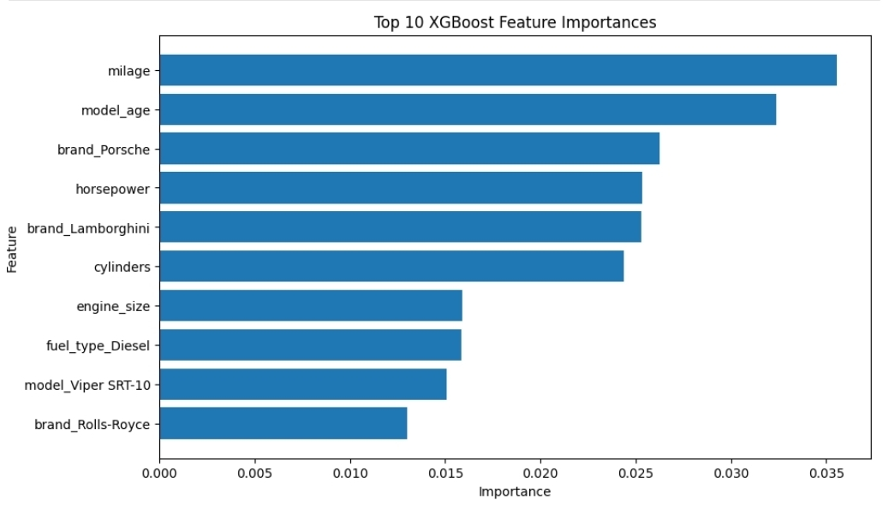
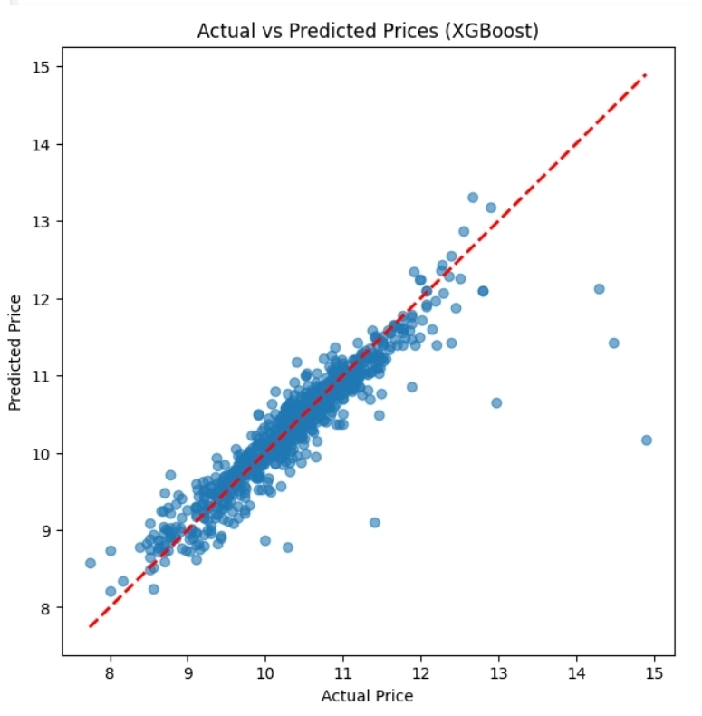

# 🚗 Used Car Price Prediction

A Machine Learning project that predicts the price of used cars using different regression models. After comparing multiple models, **XGBoost** achieved the best performance.

---

## 📌 Project Overview

This project includes:
- Data cleaning and preprocessing
- Feature engineering
- One-Hot Encoding
- Model comparison
- Hyperparameter tuning
- Feature importance analysis
- Price prediction

---

## 🛠️ Technologies Used

- Python
- Pandas
- NumPy
- Matplotlib
- Scikit-learn
- XGBoost

---

## 🤖 Models Compared

| Model | Tested |
|-------|--------|
| Linear Regression | ✅ |
| Decision Tree | ✅ |
| Random Forest | ✅ |
| XGBoost | 🏆 Best Model |

---

## 📊 Results

### Actual vs Predicted Prices (XGBoost)

The predictions closely follow the actual prices, showing that the model performs very well.



---

### Top 10 Most Important Features

Mileage and model age are the most influential features, followed by horsepower, cylinders, engine size, and several premium car brands.



---

## 📂 Project Structure

```
Used_car_prediction/
│
├── data/
├── images/
│   ├── Screenshot_20260725_165506_Chrome.jpg
│   └── Screenshot_20260725_165518_Chrome.jpg
├── main.ipynb
├── requirements.txt
└── README.md
```

---

## 🚀 Future Improvements

- Deploy with Streamlit
- Add more vehicle features
- Tune XGBoost further
- Test additional boosting algorithms

---

## 👤 Author

**Yasser**
